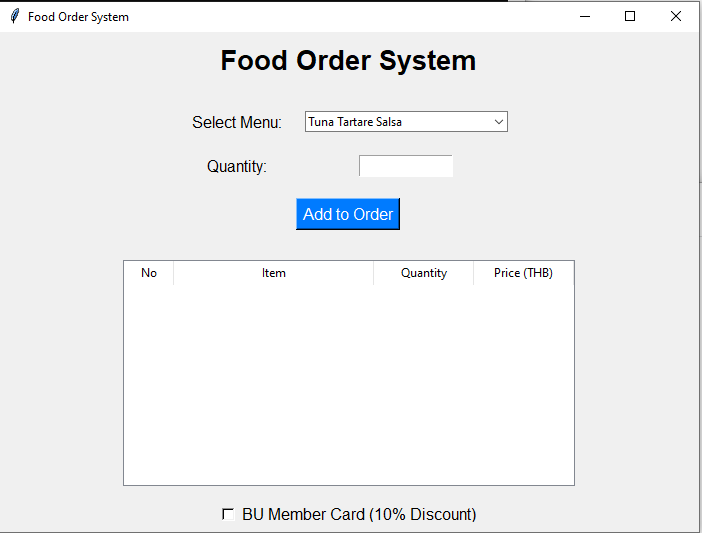
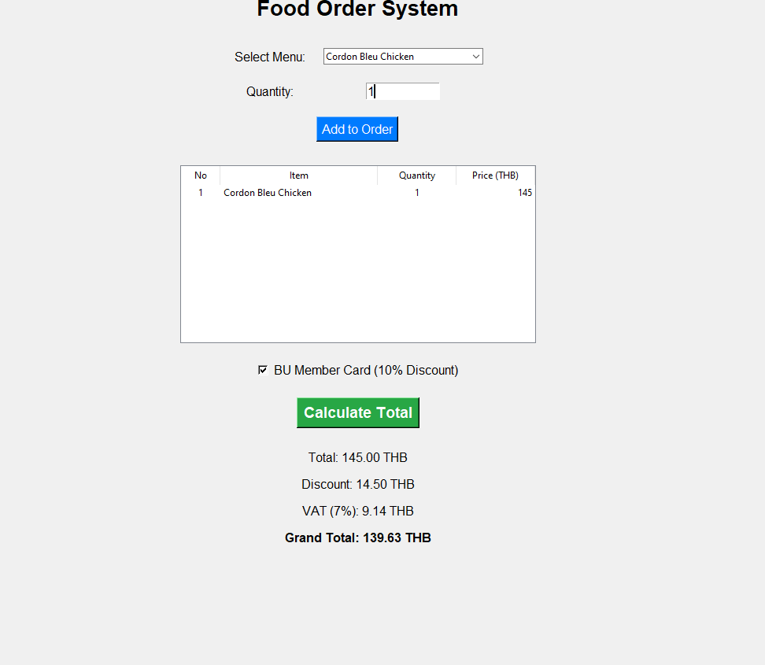

# Food Order System (GUI)

A simple and user-friendly **Food Order System** with a graphical interface built using Python's `tkinter`. This program allows users to select menu items, specify quantities, calculate total prices (including discounts and VAT), and view the order summary in a clean and organized table.

---

## Features

- **Menu Selection**: Dropdown menu to choose food and beverage items.
- **Quantity Input**: Input field to specify the quantity of items.
- **Order Summary Table**: Displays all ordered items with quantities and prices in a tabular format.
- **Discount for Members**: Apply a 10% discount for BU members.
- **VAT Calculation**: Calculates VAT at 7%.
- **Clean and Modern GUI**: Easy-to-use interface with clear labels and buttons.

---

## How It Works

1. **Choose a Menu Item**: 
   - Use the dropdown to select an item.
2. **Specify Quantity**:
   - Enter the number of items in the input box.
3. **Add to Order**:
   - Click the "Add to Order" button to add the item to the order list.
4. **Apply Discount (Optional)**:
   - Check the "BU Member Card" box to apply a 10% discount.
5. **Calculate Total**:
   - Click "Calculate Total" to view the total price, discount, VAT, and grand total.
6. **View Order**:
   - The order summary is displayed in a table.

---

## Screenshots

### Main Interface


### Order Summary Table


---

## Installation

### Prerequisites
- Python 3.6 or higher
- Required libraries: `tkinter`

### Steps
1. Clone the repository:
   ```bash
   git clone https://github.com/yourusername/food-order-system.git
   cd food-order-system
